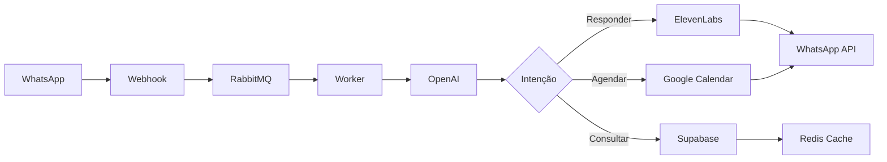

# Documentação Completa das Tecnologias - Agente IA SDR WhatsApp (2025)

> **Última Atualização**: Janeiro 2025
>
> Este documento consolida toda a documentação oficial das tecnologias utilizadas no Agente IA SDR WhatsApp, incluindo as atualizações mais recentes de 2025.

---

## 📑 Índice

1. [WhatsApp Business API (Meta)](#1-whatsapp-business-api-meta)
2. [Redis](#2-redis)
3. [RabbitMQ](#3-rabbitmq)
4. [ElevenLabs](#4-elevenlabs)
5. [OpenAI](#5-openai)
6. [Google Calendar API](#6-google-calendar-api)
7. [Supabase](#7-supabase)

---

## 1. WhatsApp Business API (Meta)

### 📌 Recursos Oficiais

- **Documentação Principal**: https://developers.facebook.com/docs/whatsapp/
- **Cloud API**: https://developers.facebook.com/docs/whatsapp/cloud-api/
- **Business Management API**: https://developers.facebook.com/docs/whatsapp/business-management-api/get-started/
- **Developer Hub**: https://business.whatsapp.com/developers/developer-hub

### 🆕 Novidades 2025

**IMPORTANTE**: A partir de **1º de julho de 2025**, o WhatsApp passou a cobrar **por mensagem entregue**, ao invés de por conversa.

**Descontinuação da On-Premises API**: A API On-Premises será descontinuada em **23 de outubro de 2025**.

### 🔑 Principais Endpoints

#### Enviar Mensagem de Texto
```http
POST /v1/messages
Content-Type: application/json

{
  "messaging_product": "whatsapp",
  "to": "5511999999999",
  "type": "text",
  "text": {
    "body": "Olá, como posso ajudar?"
  }
}
```

#### Webhooks - Receber Mensagens
```http
POST /webhooks
```

**Payload de Exemplo**:
```json
{
  "object": "whatsapp_business_account",
  "entry": [{
    "id": "WABA_ID",
    "changes": [{
      "value": {
        "messaging_product": "whatsapp",
        "metadata": {
          "display_phone_number": "15550783881",
          "phone_number_id": "106540352242922"
        },
        "contacts": [{
          "profile": {"name": "João Silva"},
          "wa_id": "5511999999999"
        }],
        "messages": [{
          "from": "5511999999999",
          "id": "wamid.ABC123",
          "timestamp": "1739230955",
          "type": "text",
          "text": {
            "body": "Olá, preciso de ajuda"
          }
        }]
      },
      "field": "messages"
    }]
  }]
}
```

#### Verificação de Webhook
```http
GET /webhooks?hub.mode=subscribe&hub.challenge={CHALLENGE}&hub.verify_token={TOKEN}
```

### 📋 Templates de Mensagem

Templates devem ser aprovados antes do uso:

```json
{
  "name": "boas_vindas_v1",
  "language": "pt_BR",
  "category": "marketing",
  "components": [
    {
      "type": "header",
      "format": "text",
      "text": "Bem-vindo à {{1}}"
    },
    {
      "type": "body",
      "text": "Olá {{1}}! Obrigado por entrar em contato. Como posso ajudá-lo hoje?"
    },
    {
      "type": "footer",
      "text": "Equipe de Atendimento"
    }
  ]
}
```

### 🔐 Autenticação

Todas as requisições requerem um token de acesso:
```
Authorization: Bearer {ACCESS_TOKEN}
```

---

## 2. Redis

### 📌 Recursos Oficiais

- **Documentação Principal**: https://redis.io/docs
- **GitHub Releases**: https://github.com/redis/redis/releases
- **Changelog 2025**: https://redis.io/docs/latest/operate/rc/changelog/

### 🆕 Novidades 2025

#### Redis 8.2 (Fall 2025)

**Melhorias de Performance**:
- ⚡ **35% mais rápido** que Redis 8.0
- ⚡ **91% mais rápido** que Redis 7.2
- 💾 **37% menor footprint de memória**
- 💾 **67% de redução** com JSON

**Novos Recursos**:
- **Redis Query Engine**: Motor de consultas avançado
- **18 estruturas de dados**: Incluindo vector sets
- **480+ comandos**: Incluindo expiração de campos hash
- **LangCache**: Caching semântico para LLMs
- **Query Performance Factor (QPF)**: Até 16x mais poder de processamento com multi-threading

### 🔑 Comandos Principais

#### Operações Básicas
```redis
# String
SET chave "valor"
GET chave
EXPIRE chave 3600

# Hash (ideal para perfis de usuário)
HSET usuario:123 nome "João" email "joao@email.com"
HGET usuario:123 nome
HGETALL usuario:123

# List (filas)
LPUSH fila:mensagens "mensagem1"
RPOP fila:mensagens

# Set
SADD tags:usuario:123 "lead" "qualificado"
SMEMBERS tags:usuario:123
```

#### Pub/Sub
```redis
# Publisher
PUBLISH canal:notificacoes "Nova mensagem recebida"

# Subscriber
SUBSCRIBE canal:notificacoes
```

#### Cache com TTL
```redis
# Cachear resposta da IA por 1 hora
SETEX cache:ia:conversa:123 3600 "Resposta gerada pela IA"
GET cache:ia:conversa:123
```

### 📊 Estruturas de Dados para IA

#### Vector Search (para embeddings)
```redis
# Criar índice para busca vetorial
FT.CREATE idx:embeddings
  ON HASH PREFIX 1 embedding:
  SCHEMA
    vector VECTOR HNSW 6 TYPE FLOAT32 DIM 1536 DISTANCE_METRIC COSINE
```

#### Top-K (rastreamento de frequência)
```redis
TOPK.ADD topk:intencoes "agendar_reuniao" "consultar_preco"
TOPK.COUNT topk:intencoes "agendar_reuniao"
TOPK.LIST topk:intencoes WITHCOUNT
```

### 🔧 Configuração Recomendada

```conf
# redis.conf
maxmemory 2gb
maxmemory-policy allkeys-lru
save 900 1
save 300 10
save 60 10000
```

---

## 3. RabbitMQ

### 📌 Recursos Oficiais

- **Documentação Principal**: https://www.rabbitmq.com/docs
- **Release Notes**: https://www.rabbitmq.com/release-information
- **Blog**: https://www.rabbitmq.com/blog

### 🆕 Novidades 2025

#### RabbitMQ 4.2.0 (Outubro 2025)

**Khepri Metadata Store** (Default a partir da 4.2):
- Baseado no algoritmo Raft (mesmo de quorum queues e streams)
- Comportamento consistente em consultas e atualizações de metadata
- Melhor confiabilidade em clusters

**AMQP 1.0 Enhancements**:
- Suporte a Direct Reply-To para AMQP 1.0
- Funciona cross-protocol

**Message Interceptors**:
- Interceptação de mensagens de entrada e saída
- Funciona com AMQP 1.0, AMQP 0.9.1, MQTTv3 e MQTTv5

**Ferramentas de Migração**:
- Blue-green deployment de v3.13.x para v4.2.0
- Comandos via rabbitmqadmin v2

### 🔑 Operações Principais

#### Publicar Mensagem
```http
PUT /api/exchanges/{vhost}/{exchange}/publish
Content-Type: application/json

{
  "properties": {
    "delivery_mode": 2,
    "content_type": "application/json"
  },
  "routing_key": "fila.mensagens",
  "payload": "{\"tipo\":\"nova_conversa\",\"usuario_id\":123}",
  "payload_encoding": "string"
}
```

**Resposta**:
```json
{"routed": true}
```

#### Criar Binding (Queue → Exchange)
```http
POST /api/bindings/{vhost}/e/{exchange}/q/{queue}

{
  "routing_key": "mensagens.whatsapp",
  "arguments": {}
}
```

#### Consumir Mensagens (via CLI)
```bash
rabbitmqadmin get queue=fila_mensagens count=10
```

### 📊 Patterns Recomendados

#### 1. Work Queue (Processamento de Mensagens)
```javascript
// Publisher
channel.sendToQueue('fila_processamento', Buffer.from(JSON.stringify({
  tipo: 'processar_mensagem',
  mensagem_id: 'msg_123',
  conteudo: 'Texto da mensagem'
})), {
  persistent: true
});

// Consumer
channel.consume('fila_processamento', async (msg) => {
  const dados = JSON.parse(msg.content.toString());
  await processarMensagem(dados);
  channel.ack(msg);
}, { noAck: false });
```

#### 2. Topic Exchange (Roteamento Flexível)
```javascript
// Criar exchange
channel.assertExchange('eventos', 'topic', { durable: true });

// Publicar
channel.publish('eventos', 'usuario.novo_lead', Buffer.from(JSON.stringify({
  usuario_id: 123,
  origem: 'whatsapp'
})));

// Consumir apenas leads do WhatsApp
channel.bindQueue('fila_leads_whatsapp', 'eventos', 'usuario.novo_lead');
```

### 🔧 Configuração Recomendada

```conf
# rabbitmq.conf
vm_memory_high_watermark.relative = 0.4
disk_free_limit.relative = 2.0
heartbeat = 60
```

---

## 4. ElevenLabs

### 📌 Recursos Oficiais

- **Documentação Principal**: https://elevenlabs.io/docs
- **API Reference**: https://elevenlabs.io/docs/api-reference/text-to-speech
- **Modelos**: https://elevenlabs.io/docs/models
- **Quickstart**: https://elevenlabs.io/docs/quickstart

### 🆕 Modelos 2025

#### Eleven Flash v2.5
- ⚡ **Ultra-low latency**: ~75ms
- 🌍 Suporte a **32 idiomas**
- 🎯 Ideal para aplicações real-time

#### Eleven v3
- 🎭 **Maior range emocional**
- 🎵 Fala natural e life-like
- 🎯 Ideal para qualidade máxima

### 🔑 API Endpoints

#### Text-to-Speech (Conversão)
```http
POST /v1/text-to-speech/{voice_id}
Content-Type: application/json
xi-api-key: {API_KEY}

{
  "text": "Olá! Como posso ajudá-lo hoje?",
  "model_id": "eleven_multilingual_v2",
  "voice_settings": {
    "stability": 0.5,
    "similarity_boost": 0.75,
    "style": 0.0,
    "use_speaker_boost": true
  }
}
```

**Resposta**: Audio stream (MP3/PCM)

#### Text-to-Speech (Streaming)
```http
POST /v1/text-to-speech/{voice_id}/stream
Content-Type: application/json
xi-api-key: {API_KEY}

{
  "text": "Texto longo para streaming...",
  "model_id": "eleven_flash_v2_5",
  "voice_settings": {
    "stability": 0.5,
    "similarity_boost": 0.75
  }
}
```

#### Listar Vozes Disponíveis
```http
GET /v1/voices
xi-api-key: {API_KEY}
```

**Resposta**:
```json
{
  "voices": [
    {
      "voice_id": "21m00Tcm4TlvDq8ikWAM",
      "name": "Rachel",
      "category": "premade",
      "labels": {
        "accent": "american",
        "age": "young",
        "gender": "female"
      }
    }
  ]
}
```

#### Voice Cloning (IVC - Instant Voice Cloning)
```http
POST /v1/voices/ivc
Content-Type: multipart/form-data
xi-api-key: {API_KEY}

{
  "name": "Voz Personalizada",
  "audio_file": [binary_audio_data],
  "description": "Voz para atendimento ao cliente"
}
```

### 🎯 Casos de Uso para SDR

```javascript
// Exemplo: Gerar áudio de resposta
async function gerarAudioResposta(texto, idioma = 'pt-BR') {
  const response = await fetch('https://api.elevenlabs.io/v1/text-to-speech/21m00Tcm4TlvDq8ikWAM/stream', {
    method: 'POST',
    headers: {
      'Content-Type': 'application/json',
      'xi-api-key': process.env.ELEVENLABS_API_KEY
    },
    body: JSON.stringify({
      text: texto,
      model_id: 'eleven_flash_v2_5', // Baixa latência
      voice_settings: {
        stability: 0.6,
        similarity_boost: 0.8,
        style: 0.2,
        use_speaker_boost: true
      }
    })
  });

  return response.body; // Audio stream
}
```

### 💰 Considerações de Custo

- **Eleven Flash v2.5**: Custo reduzido, latência ultra-baixa
- **Eleven Multilingual v2**: Custo médio, qualidade alta
- **Eleven v3**: Custo mais alto, qualidade máxima

---

## 5. OpenAI

### 📌 Recursos Oficiais

- **Documentação Principal**: https://platform.openai.com/docs
- **API Reference**: https://platform.openai.com/docs/api-reference
- **Modelos**: https://platform.openai.com/docs/models

### 🆕 Modelos 2025

#### Modelos de Linguagem

**GPT-5 Pro**
- 🚀 Modelo mais avançado da OpenAI
- 🧠 Raciocínio aprimorado
- 📝 1M tokens de contexto

**GPT-4.1 Family**
- 📊 Melhorias em coding e instruction following
- 🔍 Compreensão de contexto longo aprimorada
- 📱 GPT-4.1 nano (primeiro modelo nano)
- 💾 Até **1 milhão de tokens** de contexto (vs 128K anteriores)

#### Modelos de Raciocínio

**o3-mini** (2025-01-31)
- 🧮 Habilidades de raciocínio aprimoradas
- ⚡ Performance otimizada
- 💰 Custo-benefício

**o3-pro** e **o4-mini**
- 🎯 Raciocínio avançado
- 📊 Melhor qualidade

#### Modelos de Áudio/Voz

**gpt-4o-transcribe** e **gpt-4o-mini-transcribe**
- 🎙️ Taxa de erro de palavras melhorada
- 🌍 Melhor reconhecimento de idiomas

**gpt-4o-mini-tts**
- 🎭 Melhor controle de estilo
- 💬 Instruções de fala personalizadas (ex: "fale como um agente de atendimento empático")

### 🔑 API Endpoints

#### Chat Completions (Conversação)
```http
POST /v1/chat/completions
Content-Type: application/json
Authorization: Bearer {API_KEY}

{
  "model": "gpt-4o-mini",
  "messages": [
    {
      "role": "system",
      "content": "Você é um assistente de vendas profissional e empático."
    },
    {
      "role": "user",
      "content": "Quero saber mais sobre seus produtos"
    }
  ],
  "temperature": 0.7,
  "max_completion_tokens": 500
}
```

**Resposta**:
```json
{
  "id": "chatcmpl-123",
  "object": "chat.completion",
  "created": 1677652288,
  "model": "gpt-4o-mini",
  "choices": [
    {
      "index": 0,
      "message": {
        "role": "assistant",
        "content": "Fico feliz em ajudá-lo! Temos uma linha completa de produtos..."
      },
      "finish_reason": "stop"
    }
  ],
  "usage": {
    "prompt_tokens": 25,
    "completion_tokens": 50,
    "total_tokens": 75
  }
}
```

#### Function Calling (Ferramentas)
```http
POST /v1/chat/completions

{
  "model": "gpt-4o-mini",
  "messages": [...],
  "tools": [
    {
      "type": "function",
      "function": {
        "name": "agendar_reuniao",
        "description": "Agenda uma reunião no Google Calendar",
        "parameters": {
          "type": "object",
          "properties": {
            "data": {
              "type": "string",
              "description": "Data da reunião (YYYY-MM-DD)"
            },
            "hora": {
              "type": "string",
              "description": "Hora da reunião (HH:MM)"
            },
            "titulo": {
              "type": "string",
              "description": "Título da reunião"
            }
          },
          "required": ["data", "hora", "titulo"]
        }
      }
    }
  ],
  "tool_choice": "auto"
}
```

#### Embeddings (Vetorização de Texto)
```http
POST /v1/embeddings
Content-Type: application/json
Authorization: Bearer {API_KEY}

{
  "model": "text-embedding-3-large",
  "input": "Preciso de ajuda com o produto X",
  "encoding_format": "float"
}
```

**Resposta**:
```json
{
  "object": "list",
  "data": [
    {
      "object": "embedding",
      "embedding": [0.0023, -0.009, ...], // 3072 dimensões
      "index": 0
    }
  ],
  "model": "text-embedding-3-large",
  "usage": {
    "prompt_tokens": 8,
    "total_tokens": 8
  }
}
```

#### Áudio (Transcrição e TTS)

**Transcrição**:
```http
POST /v1/audio/transcriptions
Content-Type: multipart/form-data
Authorization: Bearer {API_KEY}

{
  "file": [audio_file],
  "model": "gpt-4o-transcribe",
  "language": "pt"
}
```

**Text-to-Speech**:
```http
POST /v1/audio/speech
Content-Type: application/json
Authorization: Bearer {API_KEY}

{
  "model": "gpt-4o-mini-tts",
  "input": "Olá, como posso ajudá-lo?",
  "voice": "alloy",
  "instructions": "Fale como um agente de atendimento empático e profissional"
}
```

### 🎯 Exemplo Completo para SDR

```javascript
// Exemplo: Assistente de vendas com function calling
async function processarMensagemLead(mensagemUsuario) {
  const response = await openai.chat.completions.create({
    model: "gpt-4o-mini",
    messages: [
      {
        role: "system",
        content: `Você é um assistente de vendas da empresa XYZ.
                  Seja empático, profissional e ajude o cliente com suas dúvidas.
                  Quando necessário, agende reuniões ou envie informações.`
      },
      {
        role: "user",
        content: mensagemUsuario
      }
    ],
    tools: [
      {
        type: "function",
        function: {
          name: "agendar_reuniao",
          description: "Agenda uma reunião no Google Calendar",
          parameters: {
            type: "object",
            properties: {
              data: { type: "string", description: "Data (YYYY-MM-DD)" },
              hora: { type: "string", description: "Hora (HH:MM)" },
              titulo: { type: "string" }
            },
            required: ["data", "hora", "titulo"]
          }
        }
      },
      {
        type: "function",
        function: {
          name: "buscar_produto",
          description: "Busca informações sobre um produto",
          parameters: {
            type: "object",
            properties: {
              nome_produto: { type: "string" }
            },
            required: ["nome_produto"]
          }
        }
      }
    ],
    tool_choice: "auto",
    temperature: 0.7
  });

  const assistantMessage = response.choices[0].message;

  // Se a IA decidiu chamar uma função
  if (assistantMessage.tool_calls) {
    for (const toolCall of assistantMessage.tool_calls) {
      const functionName = toolCall.function.name;
      const functionArgs = JSON.parse(toolCall.function.arguments);

      // Executar a função apropriada
      if (functionName === 'agendar_reuniao') {
        await agendarReuniao(functionArgs);
      } else if (functionName === 'buscar_produto') {
        await buscarProduto(functionArgs);
      }
    }
  }

  return assistantMessage.content;
}
```

### 💰 Considerações de Custo (2025)

| Modelo | Input (1M tokens) | Output (1M tokens) | Uso Recomendado |
|--------|-------------------|--------------------|-----------------|
| GPT-4.1 | $5.00 | $15.00 | Conversas complexas |
| GPT-4.1-mini | $0.15 | $0.60 | Tarefas rápidas |
| o3-mini | $3.00 | $12.00 | Raciocínio |
| Embeddings-3-large | $0.13 | - | Busca semântica |

---

## 6. Google Calendar API

### 📌 Recursos Oficiais

- **Documentação Principal**: https://developers.google.com/workspace/calendar
- **API Reference**: https://developers.google.com/calendar/api/v3/reference
- **Guias**: https://developers.google.com/workspace/calendar/api/guides/overview
- **Release Notes**: https://developers.google.com/workspace/calendar/docs/release-notes

### 🔑 Endpoints Principais

#### Criar Evento
```http
POST /calendar/v3/calendars/{calendarId}/events
Content-Type: application/json
Authorization: Bearer {ACCESS_TOKEN}

{
  "summary": "Reunião com Lead - João Silva",
  "location": "Google Meet",
  "description": "Demonstração do produto XYZ",
  "start": {
    "dateTime": "2025-01-20T10:00:00-03:00",
    "timeZone": "America/Sao_Paulo"
  },
  "end": {
    "dateTime": "2025-01-20T11:00:00-03:00",
    "timeZone": "America/Sao_Paulo"
  },
  "attendees": [
    {"email": "joao@email.com"},
    {"email": "vendedor@empresa.com"}
  ],
  "reminders": {
    "useDefault": false,
    "overrides": [
      {"method": "email", "minutes": 1440},
      {"method": "popup", "minutes": 30}
    ]
  },
  "conferenceData": {
    "createRequest": {
      "requestId": "random-string",
      "conferenceSolutionKey": {"type": "hangoutsMeet"}
    }
  }
}
```

**Resposta**:
```json
{
  "id": "evento123",
  "htmlLink": "https://www.google.com/calendar/event?eid=...",
  "hangoutLink": "https://meet.google.com/abc-defg-hij",
  "summary": "Reunião com Lead - João Silva",
  "start": {
    "dateTime": "2025-01-20T10:00:00-03:00",
    "timeZone": "America/Sao_Paulo"
  },
  "end": {
    "dateTime": "2025-01-20T11:00:00-03:00",
    "timeZone": "America/Sao_Paulo"
  }
}
```

#### Listar Eventos
```http
GET /calendar/v3/calendars/{calendarId}/events?timeMin=2025-01-01T00:00:00Z&timeMax=2025-12-31T23:59:59Z&orderBy=startTime&singleEvents=true
Authorization: Bearer {ACCESS_TOKEN}
```

#### Buscar Horários Disponíveis (Free/Busy)
```http
POST /calendar/v3/freeBusy
Content-Type: application/json
Authorization: Bearer {ACCESS_TOKEN}

{
  "timeMin": "2025-01-20T00:00:00Z",
  "timeMax": "2025-01-20T23:59:59Z",
  "items": [
    {"id": "vendedor@empresa.com"}
  ]
}
```

**Resposta**:
```json
{
  "calendars": {
    "vendedor@empresa.com": {
      "busy": [
        {
          "start": "2025-01-20T10:00:00Z",
          "end": "2025-01-20T11:00:00Z"
        },
        {
          "start": "2025-01-20T14:00:00Z",
          "end": "2025-01-20T15:00:00Z"
        }
      ]
    }
  }
}
```

#### Atualizar Evento
```http
PATCH /calendar/v3/calendars/{calendarId}/events/{eventId}
Content-Type: application/json
Authorization: Bearer {ACCESS_TOKEN}

{
  "summary": "Reunião REAGENDADA - João Silva",
  "start": {
    "dateTime": "2025-01-21T14:00:00-03:00"
  },
  "end": {
    "dateTime": "2025-01-21T15:00:00-03:00"
  }
}
```

#### Deletar Evento
```http
DELETE /calendar/v3/calendars/{calendarId}/events/{eventId}
Authorization: Bearer {ACCESS_TOKEN}
```

### 🎯 Exemplo de Integração para SDR

```javascript
// Exemplo: Agendar reunião automaticamente
async function agendarReuniaoComLead(dadosLead) {
  const { google } = require('googleapis');
  const calendar = google.calendar({ version: 'v3', auth: oauth2Client });

  // 1. Buscar horários disponíveis
  const freeBusyResponse = await calendar.freebusy.query({
    requestBody: {
      timeMin: new Date().toISOString(),
      timeMax: new Date(Date.now() + 7 * 24 * 60 * 60 * 1000).toISOString(), // próximos 7 dias
      items: [{ id: 'vendedor@empresa.com' }]
    }
  });

  const busySlots = freeBusyResponse.data.calendars['vendedor@empresa.com'].busy;

  // 2. Encontrar primeiro horário disponível
  const primeiroHorarioDisponivel = encontrarPrimeiroHorario(busySlots);

  // 3. Criar evento
  const evento = await calendar.events.insert({
    calendarId: 'primary',
    conferenceDataVersion: 1,
    requestBody: {
      summary: `Reunião - ${dadosLead.nome}`,
      description: `Lead: ${dadosLead.nome}\nOrigem: WhatsApp\nInteresse: ${dadosLead.interesse}`,
      start: {
        dateTime: primeiroHorarioDisponivel.inicio,
        timeZone: 'America/Sao_Paulo'
      },
      end: {
        dateTime: primeiroHorarioDisponivel.fim,
        timeZone: 'America/Sao_Paulo'
      },
      attendees: [
        { email: dadosLead.email },
        { email: 'vendedor@empresa.com' }
      ],
      conferenceData: {
        createRequest: {
          requestId: `lead-${dadosLead.id}-${Date.now()}`,
          conferenceSolutionKey: { type: 'hangoutsMeet' }
        }
      },
      reminders: {
        useDefault: false,
        overrides: [
          { method: 'email', minutes: 1440 }, // 1 dia antes
          { method: 'popup', minutes: 30 }
        ]
      }
    }
  });

  return {
    eventoId: evento.data.id,
    linkCalendario: evento.data.htmlLink,
    linkMeet: evento.data.hangoutLink,
    dataHora: evento.data.start.dateTime
  };
}
```

### 🔐 Autenticação OAuth 2.0

```javascript
const { google } = require('googleapis');

const oauth2Client = new google.auth.OAuth2(
  process.env.GOOGLE_CLIENT_ID,
  process.env.GOOGLE_CLIENT_SECRET,
  process.env.GOOGLE_REDIRECT_URI
);

// Definir credenciais
oauth2Client.setCredentials({
  access_token: 'ACCESS_TOKEN',
  refresh_token: 'REFRESH_TOKEN'
});
```

**Scopes necessários**:
```
https://www.googleapis.com/auth/calendar
https://www.googleapis.com/auth/calendar.events
```

---

## 7. Supabase

### 📌 Recursos Oficiais

- **Documentação Principal**: https://supabase.com/docs
- **API Reference**: https://supabase.com/docs/reference
- **Changelog**: https://supabase.com/changelog
- **GitHub**: https://github.com/supabase/supabase

### 🆕 Novidades 2025

#### Novas Funcionalidades

**Integrations Section no Dashboard**
- Módulos Postgres: Cron Jobs e Queues
- Integração facilitada

**Geo-Routing** (Abril 2025)
- Data API GET requests roteadas para o database mais próximo
- Melhor performance global

**Dedicated Pooler**
- PgBouncer co-localizado com Postgres
- Melhor performance de conexão

**Novos API Keys** (Junho 2025)
- `sb_publishable_...`: Substitui anon keys
- `sb_secret_...`: Substitui service_role keys
- Múltiplas secret keys possíveis

**Project Scoped Roles**
- Disponível para todos os planos Team
- Roles no nível de organização ou projeto

#### Melhorias Técnicas

**pgvector v0.7.0**
- Vetores float16: 30% mais rápido HNSW build
- 50% menos memória e espaço em disco
- Suporte a vetores sparse e bit

**Edge Functions**
- Redução de erros de memória
- Minimização de erros 502

### 🔑 Operações Principais

#### Autenticação

**Sign Up**:
```javascript
const { data, error } = await supabase.auth.signUp({
  email: 'usuario@email.com',
  password: 'senha_segura',
  options: {
    data: {
      nome: 'João Silva',
      tipo_usuario: 'vendedor'
    }
  }
});
```

**Sign In**:
```javascript
const { data, error } = await supabase.auth.signInWithPassword({
  email: 'usuario@email.com',
  password: 'senha_segura'
});
```

**Get User**:
```javascript
const { data: { user } } = await supabase.auth.getUser();
```

#### Database (PostgreSQL)

**Insert**:
```javascript
const { data, error } = await supabase
  .from('conversas')
  .insert({
    usuario_id: '123',
    telefone: '+5511999999999',
    mensagem: 'Olá, preciso de ajuda',
    timestamp: new Date().toISOString()
  })
  .select();
```

**Select com Filtros**:
```javascript
const { data, error } = await supabase
  .from('conversas')
  .select('*, usuarios(nome, email)')
  .eq('usuario_id', '123')
  .order('timestamp', { ascending: false })
  .limit(10);
```

**Update**:
```javascript
const { data, error } = await supabase
  .from('leads')
  .update({
    status: 'qualificado',
    data_qualificacao: new Date().toISOString()
  })
  .eq('id', leadId)
  .select();
```

**Delete**:
```javascript
const { error } = await supabase
  .from('mensagens_temporarias')
  .delete()
  .lt('created_at', new Date(Date.now() - 24 * 60 * 60 * 1000).toISOString());
```

#### Realtime (Subscrições)

```javascript
// Escutar novas mensagens
const channel = supabase
  .channel('conversas-channel')
  .on(
    'postgres_changes',
    {
      event: 'INSERT',
      schema: 'public',
      table: 'mensagens'
    },
    (payload) => {
      console.log('Nova mensagem:', payload.new);
      processarNovaMensagem(payload.new);
    }
  )
  .subscribe();

// Desinscrever
await supabase.removeChannel(channel);
```

#### Storage (Arquivos)

**Upload**:
```javascript
const { data, error } = await supabase.storage
  .from('midias')
  .upload(`audios/${userId}/${timestamp}.mp3`, audioFile, {
    contentType: 'audio/mpeg',
    cacheControl: '3600',
    upsert: false
  });
```

**Download/URL**:
```javascript
const { data } = supabase.storage
  .from('midias')
  .getPublicUrl('audios/123/audio.mp3');

console.log(data.publicUrl);
```

**List Files**:
```javascript
const { data, error } = await supabase.storage
  .from('midias')
  .list('audios/123', {
    limit: 100,
    offset: 0,
    sortBy: { column: 'created_at', order: 'desc' }
  });
```

#### Edge Functions

**Invocar função**:
```javascript
const { data, error } = await supabase.functions.invoke('processar-mensagem', {
  body: {
    mensagem_id: '123',
    conteudo: 'Texto da mensagem'
  },
  headers: {
    'Content-Type': 'application/json'
  }
});
```

### 🔐 Row Level Security (RLS)

```sql
-- Habilitar RLS
ALTER TABLE conversas ENABLE ROW LEVEL SECURITY;

-- Policy: Usuários podem ver apenas suas próprias conversas
CREATE POLICY "Usuários veem apenas suas conversas"
  ON conversas
  FOR SELECT
  TO authenticated
  USING (auth.uid() = usuario_id);

-- Policy: Usuários podem inserir suas próprias conversas
CREATE POLICY "Usuários podem criar conversas"
  ON conversas
  FOR INSERT
  TO authenticated
  WITH CHECK (auth.uid() = usuario_id);
```

### 🎯 Schema Exemplo para SDR

```sql
-- Tabela de Leads
CREATE TABLE leads (
  id UUID PRIMARY KEY DEFAULT uuid_generate_v4(),
  nome TEXT NOT NULL,
  telefone TEXT UNIQUE NOT NULL,
  email TEXT,
  empresa TEXT,
  status TEXT DEFAULT 'novo',
  origem TEXT DEFAULT 'whatsapp',
  data_criacao TIMESTAMPTZ DEFAULT NOW(),
  data_ultima_interacao TIMESTAMPTZ,
  vendedor_id UUID REFERENCES auth.users(id),
  metadata JSONB
);

-- Tabela de Conversas
CREATE TABLE conversas (
  id UUID PRIMARY KEY DEFAULT uuid_generate_v4(),
  lead_id UUID REFERENCES leads(id) ON DELETE CASCADE,
  mensagem TEXT NOT NULL,
  remetente TEXT NOT NULL CHECK (remetente IN ('lead', 'agente', 'ia')),
  timestamp TIMESTAMPTZ DEFAULT NOW(),
  metadata JSONB
);

-- Tabela de Agendamentos
CREATE TABLE agendamentos (
  id UUID PRIMARY KEY DEFAULT uuid_generate_v4(),
  lead_id UUID REFERENCES leads(id) ON DELETE CASCADE,
  titulo TEXT NOT NULL,
  data_inicio TIMESTAMPTZ NOT NULL,
  data_fim TIMESTAMPTZ NOT NULL,
  status TEXT DEFAULT 'agendado',
  google_event_id TEXT,
  link_meet TEXT,
  criado_em TIMESTAMPTZ DEFAULT NOW()
);

-- Índices para performance
CREATE INDEX idx_leads_telefone ON leads(telefone);
CREATE INDEX idx_leads_status ON leads(status);
CREATE INDEX idx_conversas_lead_id ON conversas(lead_id);
CREATE INDEX idx_conversas_timestamp ON conversas(timestamp DESC);
CREATE INDEX idx_agendamentos_data ON agendamentos(data_inicio);
```

### 📊 Vector Search (para embeddings da OpenAI)

```sql
-- Habilitar extensão
CREATE EXTENSION IF NOT EXISTS vector;

-- Tabela para armazenar embeddings
CREATE TABLE conhecimento_base (
  id UUID PRIMARY KEY DEFAULT uuid_generate_v4(),
  conteudo TEXT NOT NULL,
  embedding VECTOR(1536), -- OpenAI text-embedding-3-large
  categoria TEXT,
  criado_em TIMESTAMPTZ DEFAULT NOW()
);

-- Índice HNSW para busca vetorial rápida
CREATE INDEX ON conhecimento_base
USING hnsw (embedding vector_cosine_ops);

-- Função para busca semântica
CREATE OR REPLACE FUNCTION buscar_conhecimento(
  query_embedding VECTOR(1536),
  limite INT DEFAULT 5
)
RETURNS TABLE (
  id UUID,
  conteudo TEXT,
  categoria TEXT,
  similaridade FLOAT
) AS $$
BEGIN
  RETURN QUERY
  SELECT
    k.id,
    k.conteudo,
    k.categoria,
    1 - (k.embedding <=> query_embedding) AS similaridade
  FROM conhecimento_base k
  ORDER BY k.embedding <=> query_embedding
  LIMIT limite;
END;
$$ LANGUAGE plpgsql;
```

**Uso da busca vetorial**:
```javascript
// 1. Gerar embedding da pergunta do usuário
const embeddingResponse = await openai.embeddings.create({
  model: 'text-embedding-3-large',
  input: 'Como funciona o produto X?'
});

const queryEmbedding = embeddingResponse.data[0].embedding;

// 2. Buscar conhecimento relevante
const { data, error } = await supabase.rpc('buscar_conhecimento', {
  query_embedding: queryEmbedding,
  limite: 3
});

// 3. Usar contexto na resposta da IA
const contexto = data.map(d => d.conteudo).join('\n\n');
```

---

## 🔗 Integrações Recomendadas

### Fluxo Completo do Agente SDR



### Exemplo de Integração

```javascript
// Processar mensagem recebida do WhatsApp
async function processarMensagemWhatsApp(payload) {
  const { from, text, messageId } = payload;

  // 1. Salvar mensagem no Supabase
  const { data: lead } = await supabase
    .from('leads')
    .upsert({
      telefone: from,
      data_ultima_interacao: new Date().toISOString()
    }, {
      onConflict: 'telefone',
      returning: 'representation'
    })
    .select()
    .single();

  await supabase.from('conversas').insert({
    lead_id: lead.id,
    mensagem: text.body,
    remetente: 'lead'
  });

  // 2. Publicar no RabbitMQ para processamento assíncrono
  await rabbitmq.publish('fila_mensagens', {
    leadId: lead.id,
    mensagem: text.body,
    telefone: from
  });

  return { success: true, messageId };
}

// Worker que processa mensagens
async function processarMensagemWorker(job) {
  const { leadId, mensagem, telefone } = job;

  // 1. Buscar histórico do Redis (cache)
  let historico = await redis.get(`historico:${leadId}`);

  if (!historico) {
    // Buscar do Supabase se não estiver em cache
    const { data } = await supabase
      .from('conversas')
      .select('*')
      .eq('lead_id', leadId)
      .order('timestamp', { ascending: true })
      .limit(10);

    historico = data;
    await redis.setex(`historico:${leadId}`, 3600, JSON.stringify(historico));
  }

  // 2. Gerar resposta com OpenAI
  const response = await openai.chat.completions.create({
    model: 'gpt-4o-mini',
    messages: [
      { role: 'system', content: 'Você é um assistente de vendas...' },
      ...historico.map(h => ({
        role: h.remetente === 'lead' ? 'user' : 'assistant',
        content: h.mensagem
      })),
      { role: 'user', content: mensagem }
    ],
    tools: [
      {
        type: 'function',
        function: {
          name: 'agendar_reuniao',
          description: 'Agenda reunião no Google Calendar',
          parameters: {
            type: 'object',
            properties: {
              data: { type: 'string' },
              hora: { type: 'string' }
            }
          }
        }
      }
    ]
  });

  const resposta = response.choices[0].message;

  // 3. Se precisa agendar reunião
  if (resposta.tool_calls) {
    for (const call of resposta.tool_calls) {
      if (call.function.name === 'agendar_reuniao') {
        const args = JSON.parse(call.function.arguments);
        const evento = await agendarReuniaoGoogle({
          leadId,
          ...args
        });

        // Salvar no Supabase
        await supabase.from('agendamentos').insert({
          lead_id: leadId,
          titulo: evento.summary,
          data_inicio: evento.start.dateTime,
          data_fim: evento.end.dateTime,
          google_event_id: evento.id,
          link_meet: evento.hangoutLink
        });

        // Enviar confirmação por WhatsApp
        await enviarMensagemWhatsApp(telefone,
          `Reunião agendada para ${args.data} às ${args.hora}!\n` +
          `Link: ${evento.hangoutLink}`
        );
      }
    }
  }

  // 4. Gerar áudio da resposta (opcional)
  const audio = await elevenlabs.textToSpeech({
    text: resposta.content,
    voice_id: 'rachel',
    model_id: 'eleven_flash_v2_5'
  });

  // 5. Upload do áudio no Supabase Storage
  const audioPath = `audios/${leadId}/${Date.now()}.mp3`;
  await supabase.storage
    .from('midias')
    .upload(audioPath, audio);

  const { data: { publicUrl } } = supabase.storage
    .from('midias')
    .getPublicUrl(audioPath);

  // 6. Enviar resposta por WhatsApp
  await enviarMensagemWhatsApp(telefone, resposta.content);
  // await enviarAudioWhatsApp(telefone, publicUrl); // Se preferir áudio

  // 7. Salvar resposta no Supabase
  await supabase.from('conversas').insert({
    lead_id: leadId,
    mensagem: resposta.content,
    remetente: 'ia'
  });

  // 8. Atualizar cache do Redis
  await redis.del(`historico:${leadId}`);
}
```

---

## 📚 Recursos Adicionais

### Links Úteis

- **WhatsApp**: https://developers.facebook.com/docs/whatsapp/
- **Redis**: https://redis.io/docs
- **RabbitMQ**: https://www.rabbitmq.com/docs
- **ElevenLabs**: https://elevenlabs.io/docs
- **OpenAI**: https://platform.openai.com/docs
- **Google Calendar**: https://developers.google.com/workspace/calendar
- **Supabase**: https://supabase.com/docs

### Comunidades

- **WhatsApp Developers**: https://developers.facebook.com/community/
- **Redis Discord**: https://discord.gg/redis
- **RabbitMQ Slack**: https://rabbitmq-slack.herokuapp.com/
- **OpenAI Forum**: https://community.openai.com/
- **Supabase Discord**: https://discord.supabase.com/

---

## ⚠️ Notas Importantes

1. **Rate Limits**: Todas as APIs possuem limites de requisições. Consulte a documentação específica.
2. **Custos**: Monitore o uso das APIs para evitar custos inesperados.
3. **Segurança**: Nunca exponha API keys no código. Use variáveis de ambiente.
4. **Backup**: Sempre mantenha backups dos dados críticos.
5. **Monitoramento**: Implemente logging e monitoramento adequados.

---

**Documento gerado em**: Janeiro 2025
**Versão**: 1.0


ElevenLabs vamos usar o eleven multilingual 2.0
OpenAI LLM vamos usar o gpt-4o-mini para mensagens e para transcrever audios, imagens, videos e documentos voce pode decidir
